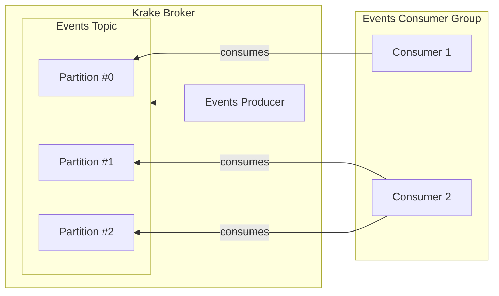

# Krake
Krake is a smaller subset of kafka.

## Table of Contents
- [Krake](#krake)
  - [Table of Contents](#table-of-contents)
  - [State of Play](#state-of-play)
  - [Goals](#goals)
    - [Notes on the (lack of) Kafka API](#notes-on-the-lack-of-kafka-api)
  - [High-level Architecture (WIP)](#high-level-architecture-wip)
    - [Technology](#technology)
  - [Non-goals (WIP)](#non-goals-wip)
  - [License](#license)

## State of Play

Currently Krake is not ready for production use and is a work in progress.

## Goals
Kafka can be challenging to use for smaller organizations when maintaining a cluster of Kafka brokers. Existing solutions like MSK or Confluent's managed Kafka can be costly, and it's difficult to set up and manage your own broker instances, especially on Kubernetes.

Krake aims to provide similar guarantees, semantics, and a familiar Kafka-like API while offering a modern and low-footprint design that can be hosted on smaller Kubernetes clusters. It doesn't require Zookeeper, has no 2GB minimum per broker, and is easier to host on Kubernetes or spin up on small DigitalOcean instances if you self-manage.*

1. Runs on kubernetes (custom operator?)
2. Compatible with a subset of the Kafka APIs - to be decided _how_ compatible (not everything will be supported)
3. Written in Go meaning lower overheads than the JVM
4. Tiered storage from the get-go
   
The primary scenario for using Krake is a small organisation or start up that wants to have something low-effort, opinionated, and easy to manage yet unlock the benefits of an event-driven architecture and some existing Kafka tooling and expertise.

*In theory. Krake is a work-in-progress and may do anything it likes up to and including eating your laundry.

### Notes on the (lack of) Kafka API
Krake does _not_ support the Kafka API on the wire, i.e. the exact protocol. Why?

- It complicates implementation details
- It adds a tight coupling to the kafka api itself

## High-level Architecture (WIP)
The high level architecture is broadly the same as Kafka when it comes to topics, partitions, segments, in-sync-replicas, message consuming and producing and most configuration properties you would expect in Kafka.

### Technology
Krake uses gRPC for managing client/server connections between producers, consumers, and the primary broker. Raft (or some variant of Raft) will be used for managing consistency among nodes in a Krake cluster. Go is the primary language of choice for Krake across the entire stack.

## Non-goals (WIP)
1. broker affinity - partitions will be expected to be on all hosts.
2. ...

## License
See the [LICENSE](./LICENSE)